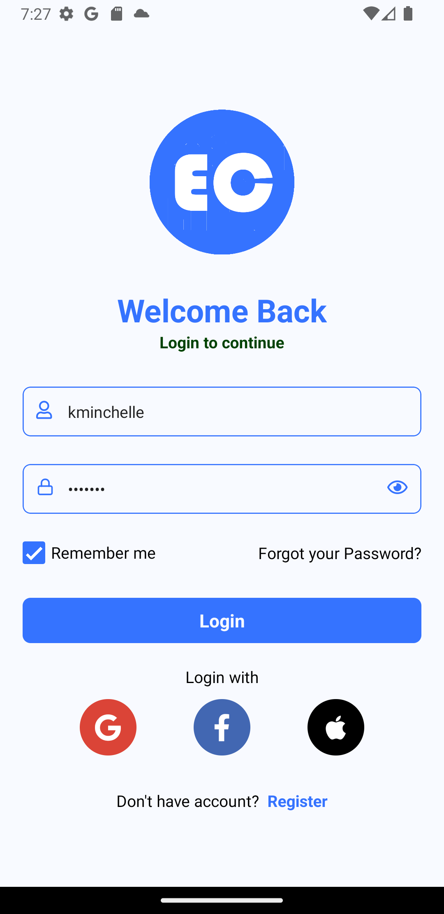
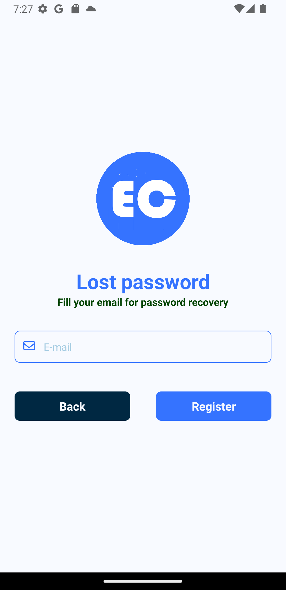
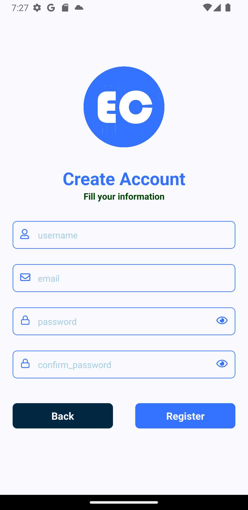
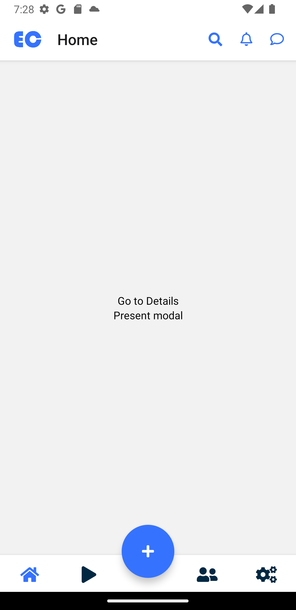
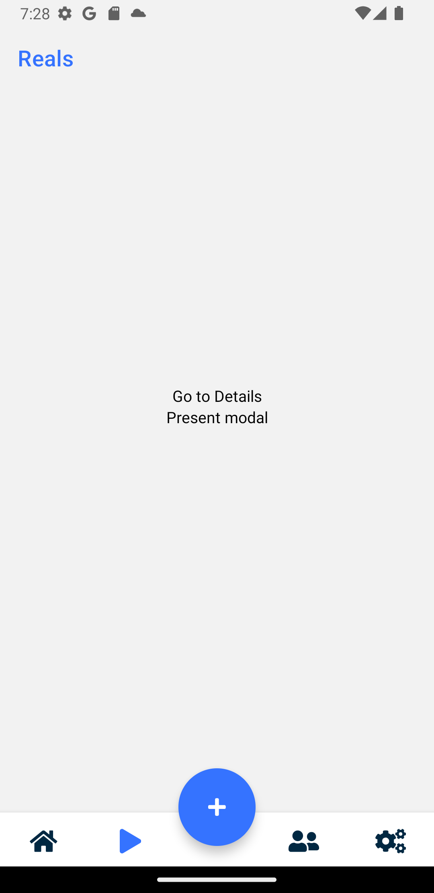
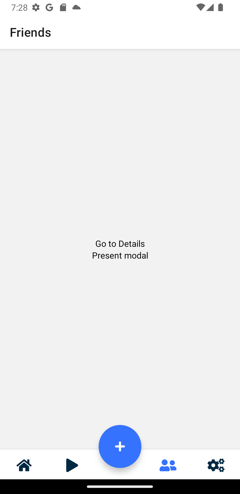
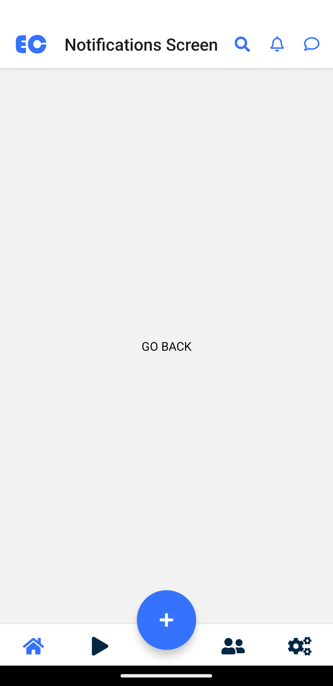
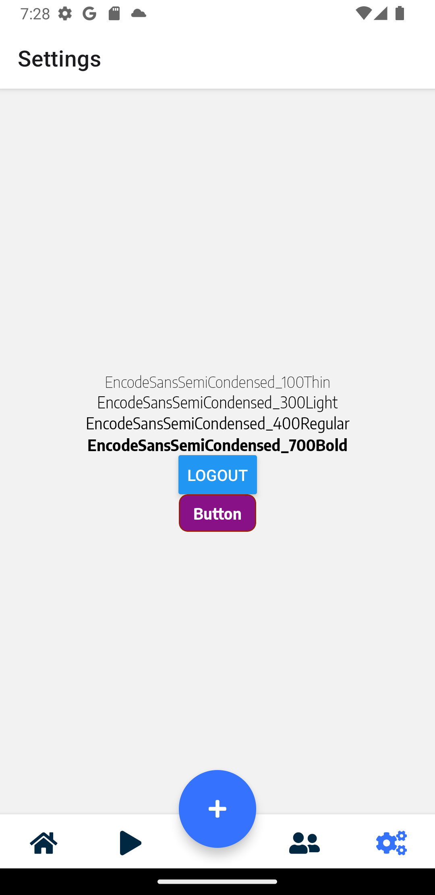
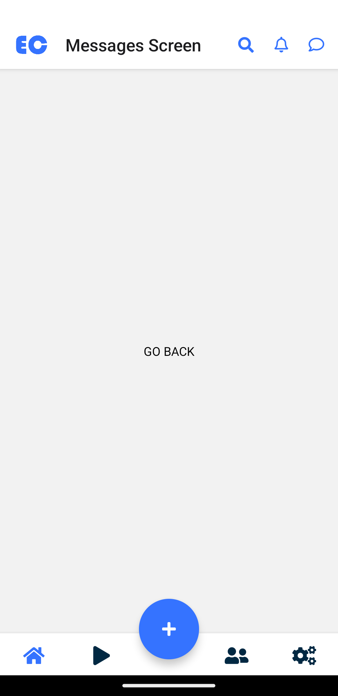
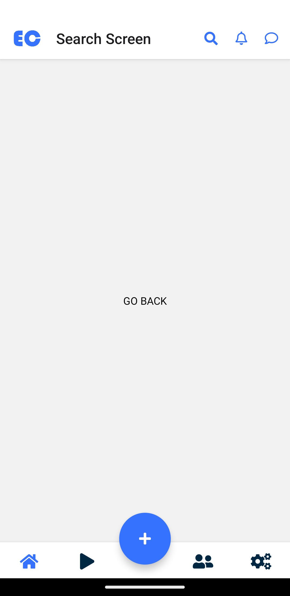

# 📱 Expo Router Tabs With Redux Template
An Expo Router Redux based app template
You can use this template as a base for your own expo app, 

         

How to install:
Copy .env-example to .env and set the api url in .env 
 EXPO_PUBLIC_API_URL=API_URL

To test in Expo go, use
 yarn start
Then scan the qt code in Expo go app

## 📝 Notes

- [Expo Router: Docs](https://expo.github.io/router)
- [Expo Router: Repo](https://github.com/expo/router)
- [Request for Comments](https://github.com/expo/router/discussions/1)

## Thanks to Aaron Saunders
- code - https://github.com/aaronksaunders/reactnative-file-router-1
